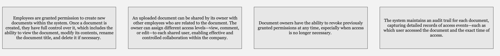
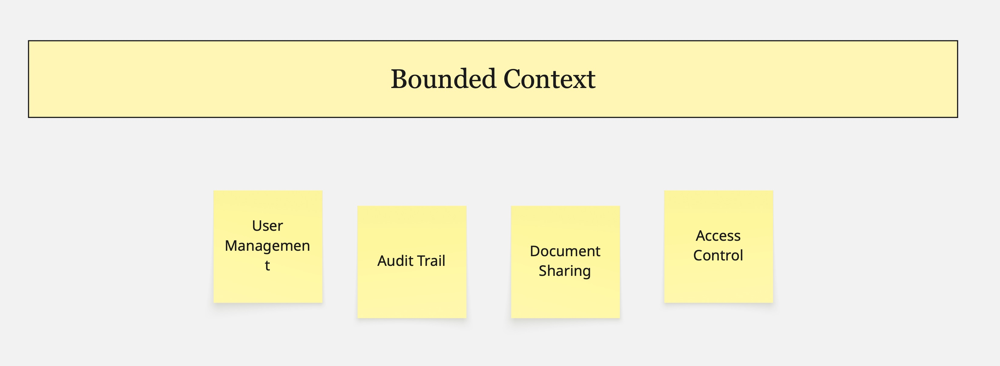
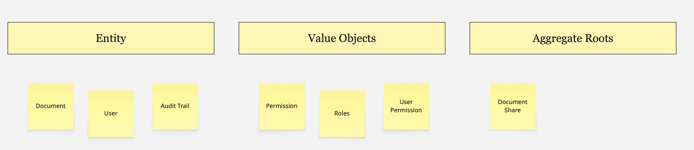
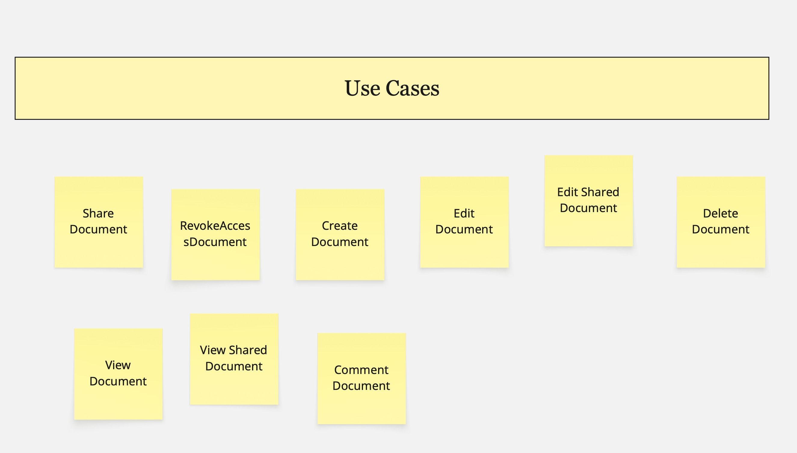

# Table Content
1. [About](#about)
2. [Domain description](#domain-description)

## About
This is project of a document sharing, driven by [business requirements](#domain-description). We use techniques strongly connected with Domain Driven Design.

## Domain description
The company needs a safe, flexible, and controlled document sharing system. Employees can create internal or client-related documents and share them with their colleagues. The document owner can restrict access based on roles, specific needs, or organizational structures such as teams, projects, and others. Available access levels include edit, comment, and view, allowing seamless collaboration within the company. Owners can also revoke previously granted permissions when no longer needed. An audit trail is available to track who accessed the document and when.

## Process

The first thing we started with was domain exploration from the description in the previous chapter. 

   

## Contextual

### Bounded Context

   

   

   

